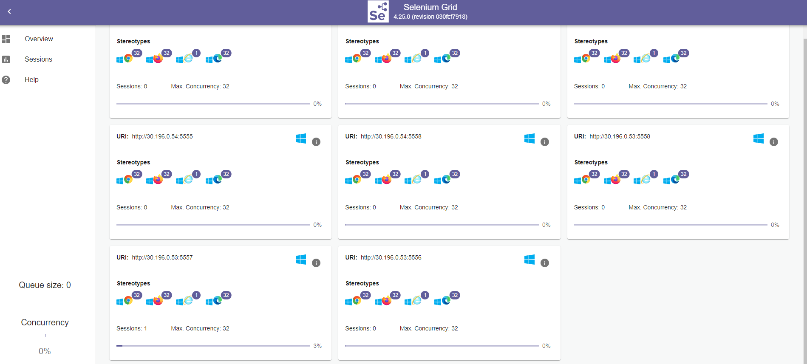

# Selenium Grid Setup for Windows Servers

This documentation provides step-by-step instructions for setting up Selenium Grid with Hub and Node configuration on Windows servers.

## Architecture Overview

- **Hub Server**: `rd95pwvcdo300.molsof.com`
- **Node Servers**: 
  - `rd95pwvcdo302.molsof.com`
  - `rd95pwvcdo303.molsof.com` 
  - `rd95pwvcdo306.molsof.com`

## Prerequisites

- Windows Server environment
- Administrative access to all servers
- Network connectivity between Hub and Node servers

## Hub Server Setup

### Server: `rd95pwvcdo300.molsof.com`

#### Step 1: Install Java JDK 17

**Download the below zip and unzip. Place it C:/Program Files directory**

https://corretto.aws/downloads/latest/amazon-corretto-17-x64-windows-jdk.zip

#### Step 2: Download Selenium Server

1. Download the latest Selenium Server JAR file from:
   ```
   https://github.com/SeleniumHQ/selenium/releases/download/selenium-4.25.0/selenium-server-4.25.0.jar
   ```

2. Place the JAR file in `D:\devops\selenium\` directory

#### Step 3: Create Hub Startup Script

Create a batch file named `start_hub.bat` with the following content:

```batch
@echo off
"C:\Program Files\Java\OpenJDK-17\bin\java" -jar "D:\devops\selenium\selenium-server-4.25.0.jar" hub
pause
```

#### Step 4: Install NSSM (Non-Sucking Service Manager)

Download and install NSSM on the hub server to run Selenium Hub as a Windows service.

#### Step 5: Configure Hub Service

Open an elevated command prompt and run the following commands:

```cmd
nssm install SeleniumHub "D:\devops\selenium\start_hub.bat"
nssm set SeleniumHub AppDirectory D:\devops\selenium
nssm set SeleniumHub DisplayName "Selenium Grid Hub"
nssm set SeleniumHub Description "Selenium Grid Hub Service"
nssm set SeleniumHub Start SERVICE_AUTO_START
nssm set SeleniumHub AppRestartDelay 5000
nssm set SeleniumHub AppStdout D:\devops\selenium\hub_output.log
nssm set SeleniumHub AppStderr D:\devops\selenium\hub_error.log
```

## Node Server Setup

### Servers: `rd95pwvcdo302.molsof.com`, `rd95pwvcdo303.molsof.com`, `rd95pwvcdo306.molsof.com`

#### Step 1: Install Java JDK 17

```
https://corretto.aws/downloads/latest/amazon-corretto-17-x64-windows-jdk.zip

```
#### Step 2: Download Selenium Server

1. Download the Selenium Server JAR file:
   ```
   https://github.com/SeleniumHQ/selenium/releases/download/selenium-4.25.0/selenium-server-4.25.0.jar
   ```

2. Place it in `D:\devops\selenium\` directory

#### Step 3: Download Browser Drivers

1. **ChromeDriver**: Download from [Chrome for Testing](https://googlechromelabs.github.io/chrome-for-testing/)

2. Create a folder structure:
   ```
   C:\driver\chromedriver-win64\chromedriver-win64\
   ```

3. Copy the downloaded ChromeDriver executable to this directory

#### Step 4: Create Node Startup Scripts

Create startup batch scripts with the following content:

**Note replace the hub ip with ip address of the hub server**. 
**start_node.bat:**
```batch
@echo off
"C:\Program Files\Java\OpenJDK-17\bin\java" -Dwebdriver.chrome.driver="C:\driver\chromedriver-win64\chromedriver-win64\chromedriver.exe" -Dselenium.maxSessions=5 -Dselenium.node.maxSession=5 -jar "D:\devops\selenium\selenium-server-4.25.0.jar" node --port 5555 --detect-drivers true --publish-events tcp://${HUBIP}:4442 --subscribe-events tcp://${HUBIP}:4443
```
**start_node1.bat:**
```batch
@echo off
"C:\Program Files\Java\OpenJDK-17\bin\java" -Dwebdriver.chrome.driver="C:\driver\chromedriver-win64\chromedriver-win64\chromedriver.exe" -Dselenium.maxSessions=5 -Dselenium.node.maxSession=5 -jar "D:\devops\selenium\selenium-server-4.25.0.jar" node --port 5556 --detect-drivers true --publish-events tcp://${HUBIP}:4442 --subscribe-events tcp://${HUBIP}:4443
```
**start_node2.bat:**
```batch
@echo off
"C:\Program Files\Java\OpenJDK-17\bin\java" -Dwebdriver.chrome.driver="C:\driver\chromedriver-win64\chromedriver-win64\chromedriver.exe" -Dselenium.maxSessions=5 -Dselenium.node.maxSession=5 -jar "D:\devops\selenium\selenium-server-4.25.0.jar" node --port 5557 --detect-drivers true --publish-events tcp://${HUBIP}:4442 --subscribe-events tcp://${HUBIP}:4443
```
**start_node3.bat:**
```batch
@echo off
"C:\Program Files\Java\OpenJDK-17\bin\java" -Dwebdriver.chrome.driver="C:\driver\chromedriver-win64\chromedriver-win64\chromedriver.exe" -Dselenium.maxSessions=5 -Dselenium.node.maxSession=5 -jar "D:\devops\selenium\selenium-server-4.25.0.jar" node --port 5558 --detect-drivers true --publish-events tcp://${HUBIP}:4442 --subscribe-events tcp://${HUBIP}:4443
```
Place all the start_node scripts under devops directory.

#### Step 5: Install NSSM

Download and install NSSM on each node server.

#### Step 6: Configure System Path

Add the NSSM executable path to the system environment variables PATH.

#### Step 7: Configure Node Services

Execute the following commands for each node service:

**SeleniumNode Service:**
```cmd
nssm install SeleniumNode "D:\devops\selenium\start_node.bat"
nssm set SeleniumNode AppDirectory D:\devops\selenium
nssm set SeleniumNode DisplayName "Selenium Node"
nssm set SeleniumNode Description "Selenium Node Service"
nssm set SeleniumNode Start SERVICE_AUTO_START
nssm set SeleniumNode AppRestartDelay 5000
nssm set SeleniumNode AppStdout D:\devops\selenium\node_output.log
nssm set SeleniumNode AppStderr D:\devops\selenium\node_error.log
```

**SeleniumNode1 Service:**
```cmd
nssm install SeleniumNode1 "D:\devops\selenium\start_node1.bat"
nssm set SeleniumNode1 AppDirectory D:\devops\selenium
nssm set SeleniumNode1 DisplayName "Selenium Node1"
nssm set SeleniumNode1 Description "Selenium Node1 Service"
nssm set SeleniumNode1 Start SERVICE_AUTO_START
nssm set SeleniumNode1 AppRestartDelay 5000
nssm set SeleniumNode1 AppStdout D:\devops\selenium\node1_output.log
nssm set SeleniumNode1 AppStderr D:\devops\selenium\node1_error.log
```

**SeleniumNode2 Service:**
```cmd
nssm install SeleniumNode2 "D:\devops\selenium\start_node2.bat"
nssm set SeleniumNode2 AppDirectory D:\devops\selenium
nssm set SeleniumNode2 DisplayName "Selenium Node2"
nssm set SeleniumNode2 Description "Selenium Node2 Service"
nssm set SeleniumNode2 Start SERVICE_AUTO_START
nssm set SeleniumNode2 AppRestartDelay 5000
nssm set SeleniumNode2 AppStdout D:\devops\selenium\node2_output.log
nssm set SeleniumNode2 AppStderr D:\devops\selenium\node2_error.log
```

**SeleniumNode3 Service:**
```cmd
nssm install SeleniumNode3 "D:\devops\selenium\start_node3.bat"
nssm set SeleniumNode3 AppDirectory D:\devops\selenium
nssm set SeleniumNode3 DisplayName "Selenium Node3"
nssm set SeleniumNode3 Description "Selenium Node3 Service"
nssm set SeleniumNode3 Start SERVICE_AUTO_START
nssm set SeleniumNode3 AppRestartDelay 5000
nssm set SeleniumNode3 AppStdout D:\devops\selenium\node3_output.log
nssm set SeleniumNode3 AppStderr D:\devops\selenium\node3_error.log
```

#### Step 8: Verify Node Registration

Check that nodes are successfully registered with the hub by:

1. Accessing the Selenium Grid Console (typically at `http://rd95pwvcdo300.molsof.com:4444/grid/console`)
2. Verifying that all expected nodes appear in the grid
3. Checking the log files for any connection issues

## Configuration Details

### Hub Configuration
- **Default Port**: 4444
- **Event Bus Ports**: 4442 (publish), 4443 (subscribe)
- **Log Files**: `hub_output.log`, `hub_error.log`

### Node Configuration
- **Default Port**: 5555
- **Max Sessions**: 5 per node
- **Browser**: Chrome with ChromeDriver
- **Log Files**: `node_output.log`, `node_error.log` (and variants for multiple nodes)

## Directory Structure

```
D:\devops\selenium\
├── selenium-server-4.25.0.jar
├── start_hub.bat
├── start_node.bat
├── start_node1.bat
├── start_node2.bat
├── start_node3.bat
├── hub_output.log
├── hub_error.log
├── node_output.log
├── node_error.log
├── node1_output.log
├── node1_error.log
├── node2_output.log
├── node2_error.log
├── node3_output.log
└── node3_error.log

C:\driver\chromedriver-win64\chromedriver-win64\
└── chromedriver.exe
```
We can configure a NGINX webserver to proxy requests back to hub server on port 4444 using https.
**nginx.conf** is placed for more clarifications in repo.

After successful setup you will see a page when you hit the url https://cmseleniumprd.molsof.com or the hub url directcly http://rdpwvcdo300.molsof.com:4444.



## Troubleshooting

### Common Issues

1. **Nodes not registering**: Check network connectivity and firewall settings
2. **Service startup failures**: Verify Java installation and file paths
3. **Browser driver issues**: Ensure ChromeDriver version compatibility with installed Chrome

### Log File Locations

- Hub logs: `D:\devops\selenium\hub_output.log` and `hub_error.log`
- Node logs: `D:\devops\selenium\node_output.log` and `node_error.log`

### Service Management

Use Windows Services Manager or NSSM commands to:
- Start/Stop services: `nssm start/stop ServiceName`
- Remove services: `nssm remove ServiceName`
- Check service status: `nssm status ServiceName`

## Security Considerations

- Ensure proper firewall rules for required ports (4442, 4443, 4444, 5555, 5556, 5557, 5558)
- Consider using HTTPS for production environments
- Regularly update Selenium Server and browser drivers
- Monitor log files for security-related events

## Maintenance

- Regular updates of Selenium Server JAR files
- Browser driver updates to match browser versions
- Log file rotation and cleanup
- Performance monitoring and capacity planning
